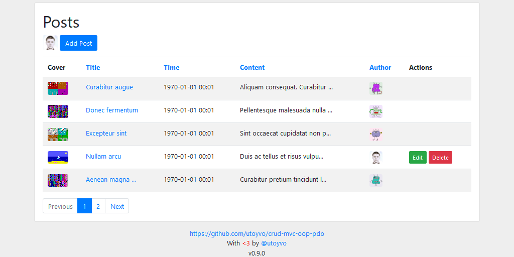

# CRUD MVC OOP PDO

A simple and intuitive CRUD system using the MVC pattern in OOP paradigm. To connect to the database using PDO.



## STRUCTURE

```
├── app
│   ├── controllers
|   |   ├── MainController.php
|   |   ├── PostsController.php
|   |   └── UsersController.php
│   ├── models
|   |   ├── PostsModel.php
|   |   └── UsersModel.php
|   └── views
|       ├── posts
|       │   ├── add.php
|       │   ├── edit.php
|       │   ├── post.php
|       |   └── posts.php
|       ├── users
|       │   ├── edit.php
|       │   ├── panel.php
|       │   ├── sign-in.php
|       │   ├── sign-up.php
|       │   ├── user.php
|       |   └── users.php
|       ├── footer.php
|       ├── header.php
|       └── pagination.php
├── core
│   ├── classes
|   │   ├── Controller.php
|   |   ├── Model.php
|   |   ├── Sql.php
|   |   └── ValidationException.php
│   ├── config
|   │   ├── database.php
|   |   └── session.php
│   ├── helpers
|   │   ├── Email.php
|   │   ├── Errors.php
|   │   ├── File.php
|   │   ├── Site.php
|   │   ├── Str.php
|   │   ├── Time.php
|   |   └── User.php
|   └── App.php
├── public
│   ├── assets
│   │   ├── css
│   │   │   └── style.css
│   |   └── js
│   │       └── main.js
│   └── uploads
│       └── .empty
├── .htaccess
├── LICENSE
├── README.md
├── database.sql
├── error.log
├── index.php
├── install.php
├── screenshot.png
└── version.json
```

## REQUIREMENTS

### System requirements

- Apache.
- PHP 7.2.0 or higher.

### PHP extensions

- PHP [Data Objects (PDO)](https://www.php.net/manual/en/book.pdo.php) module for accessing databases.
- PHP [mbstring](http://php.net/manual/en/book.mbstring.php) module for full UTF-8 support.
- PHP [gd](http://php.net/manual/en/book.image.php) or [ImageMagick](http://php.net/manual/en/book.imagick.php) module for image processing.
- PHP [JSON](https://php.net/manual/en/book.json.php) module for JSON manipulation.
- PHP [Fileinfo](https://www.php.net/manual/en/book.fileinfo.php).
- PHP [SPL](https://www.php.net/manual/en/book.spl.php).
- PHP [DOM](https://www.php.net/manual/ru/class.domdocument.php).

### Database

- [MySQL](https://www.mysql.com/) or [MariaDB](https://mariadb.com/).

## CONFIG

### Database

```php
$this->config['db'] = array(
	'driver'   => 'mysql',
	'host'     => 'localhost',
	'username' => 'root',
	'password' => '',
	'name'     => 'crud-mvc-oop-pdo'
);
```

### Session

```php
$this->config['session-name'] = 'SID';
```

## DATABASE

### Posts

| Field        | Type         | Null | Key | Default           | Extra                       |
|:-------------|:-------------|:-----|:----|:------------------|:----------------------------|
| post_id      | INT(11)      | NO   | PRI | NULL              | AUTO_INCREMENT              |
| post_created | DATETIME     | NO   |     | CURRENT_TIMESTAMP |                             |
| post_updated | DATETIME     | NO   |     | CURRENT_TIMESTAMP | ON UPDATE CURRENT_TIMESTAMP |
| post_title   | VARCHAR(255) | NO   |     | NULL              |                             |
| post_author  | INT(11)      | NO   |     | NULL              |                             |
| post_content | TEXT         | NO   |     | NULL              |                             |
| post_cover   | VARCHAR(255) | NO   |     | NULL              |                             |

### Users

| Field         | Type         | Null | Key | Default           | Extra                       |
|:--------------|:-------------|:-----|:----|:------------------|:----------------------------|
| user_id       | INT(11)      | NO   | PRI | NULL              | AUTO_INCREMENT              |
| user_created  | DATETIME     | NO   |     | CURRENT_TIMESTAMP |                             |
| user_updated  | DATETIME     | NO   |     | CURRENT_TIMESTAMP | ON UPDATE CURRENT_TIMESTAMP |
| user_name     | VARCHAR(255) | NO   |     | NULL              |                             |
| user_email    | VARCHAR(255) | NO   |     | NULL              |                             |
| user_password | VARCHAR(255) | NO   |     | NULL              |                             |
| user_role     | VARCHAR(20)  | NO   |     | NULL              |                             |

## CONTRIBUTOR

Oleksandr Klochko [@utoyvo](https://github.com/utoyvo)

## LICENSE

Code released under the [MIT License](LICENSE).
